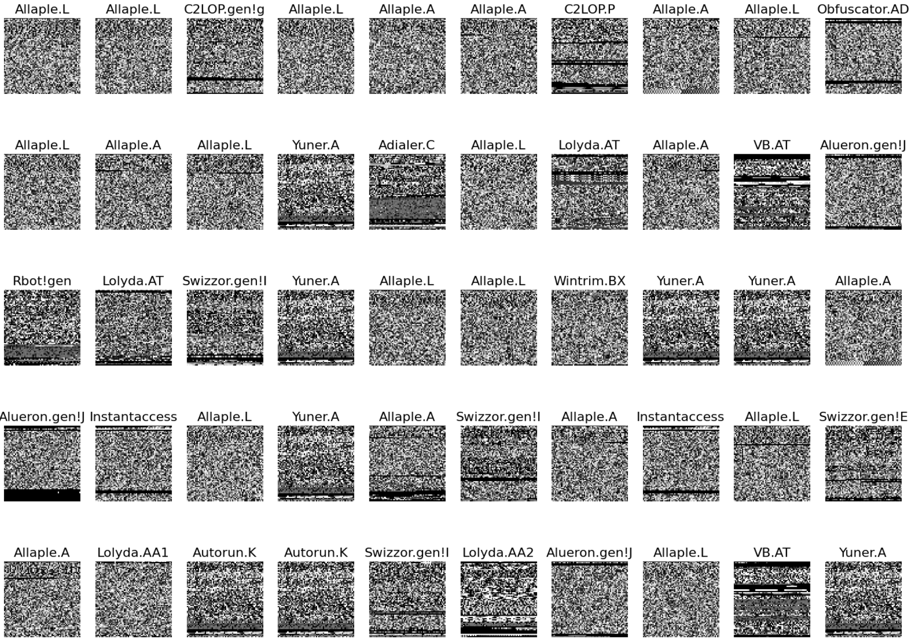

# CSCI693 ResNet vs. DenseNet for Malware Represented as Images

A research project for CSCI693: Research Methods in Comp Sci. This project aims to perform a comparative analysis of two very popular image classification CNNs: ResNet and DenseNet to uncover advantages and disadvantages when classifying malware represented as images. 

## Dataset:
- MALImg Dataset: https://www.kaggle.com/datasets/ikrambenabd/malimg-original

### Example Images


### Dataset Metrics:
- 1.18GB
- 9,339 malware byteplot images
- 25 families

## Tested Models:
- ResNet: 50, 101, 152
- DenseNet: 121, 169, 201

Models from: https://keras.io/api/applications/

## Experimental Environment:

### GPU Info [nvidia-smi report]:
```       
+---------------------------------------------------------------------------------------+
| NVIDIA-SMI 535.230.02             Driver Version: 535.230.02   CUDA Version: 12.2     |
|-----------------------------------------+----------------------+----------------------+
| GPU  Name                 Persistence-M | Bus-Id        Disp.A | Volatile Uncorr. ECC |
| Fan  Temp   Perf          Pwr:Usage/Cap |         Memory-Usage | GPU-Util  Compute M. |
|                                         |                      |               MIG M. |
|=========================================+======================+======================|
|   0  NVIDIA A100 80GB PCIe          On  | 00000000:03:00.0 Off |                    0 |
| N/A   49C    P0              69W / 300W |  79572MiB / 81920MiB |      5%      Default |
|                                         |                      |             Disabled |
+-----------------------------------------+----------------------+----------------------+
                                                                                         
+---------------------------------------------------------------------------------------+
| Processes:                                                                            |
|  GPU   GI   CI        PID   Type   Process name                            GPU Memory |
|        ID   ID                                                             Usage      |
|=======================================================================================|
|    0   N/A  N/A   2170519      C   python                                    79548MiB |
+---------------------------------------------------------------------------------------+
```

### CPU Info [lscpu report]:

```
Architecture:             x86_64
  CPU op-mode(s):         32-bit, 64-bit
  Address sizes:          45 bits physical, 48 bits virtual
  Byte Order:             Little Endian
CPU(s):                   16
  On-line CPU(s) list:    0-15
Vendor ID:                GenuineIntel
  Model name:             Intel(R) Xeon(R) Gold 6230 CPU @ 2.10GHz
    CPU family:           6
    Model:                85
    Thread(s) per core:   1
    Core(s) per socket:   1
    Socket(s):            16
```

### CLI Environment

- Python 3.10.12 Virtual Environment for dependencies 
- Jupyter Lab for running .ipynb files

### Major Dependencies

- jupyter[lab, notebook]
- keras[applications]
- matplotlib
- seaborn
- pandas
- pillow
- tensorflow
- scikit learn